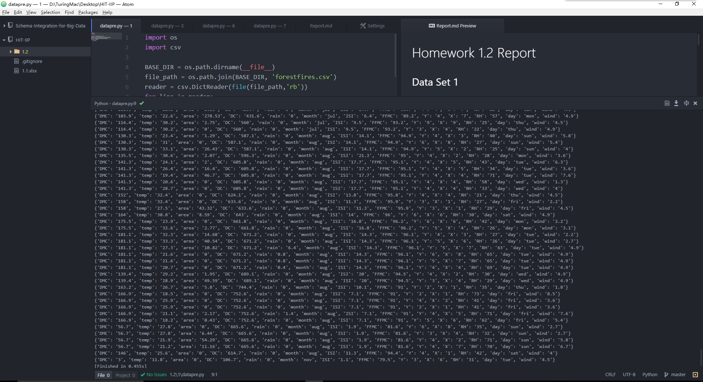
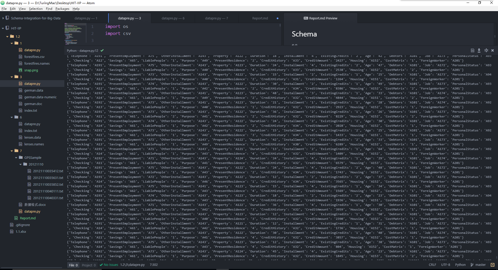
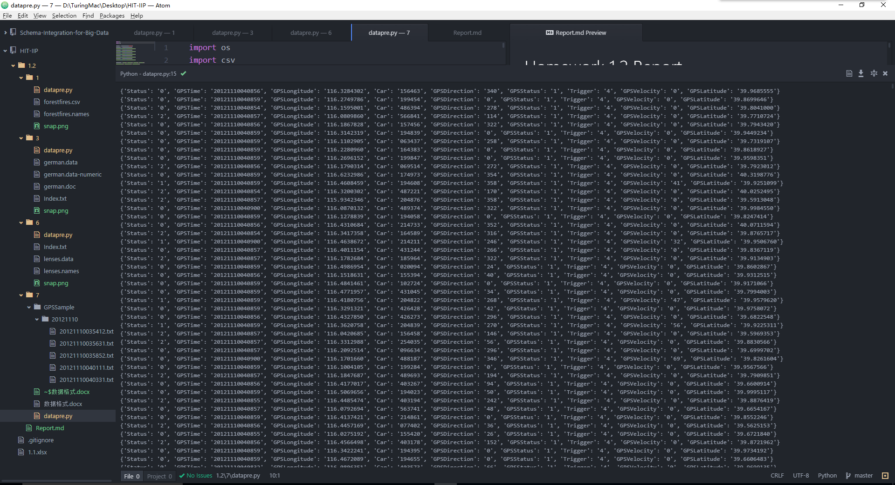

# Homework 1.2 Report

## Data Set 1

### Schema

e.g.

```
{'DMC': '3',
'temp': '11.8',
'area': '0',
'DC': '106.7',
'rain': '0',
'month': 'nov',
'ISI': '1.1',
'FFMC': '79.5',
'Y': '3',
'X': '6',
'RH': '31',
'day': 'tue',
'wind': '4.5'}
```

**Description**

- X - x-axis spatial coordinate within the Montesinho park map: 1 to 9
- Y - y-axis spatial coordinate within the Montesinho park map: 2 to 9
- month - month of the year: "jan" to "dec"
- day - day of the week: "mon" to "sun"
- FFMC - FFMC index from the FWI system: 18.7 to 96.20
- DMC - DMC index from the FWI system: 1.1 to 291.3
- DC - DC index from the FWI system: 7.9 to 860.6
- ISI - ISI index from the FWI system: 0.0 to 56.10
- temp - temperature in Celsius degrees: 2.2 to 33.30
- RH - relative humidity in %: 15.0 to 100
- wind - wind speed in km/h: 0.40 to 9.40
- rain - outside rain in mm/m2 : 0.0 to 6.4
- area - the burned area of the forest (in ha): 0.00 to 1090.84

### Running Snap



## Data Set 3

### Schema

e.g.

```
{'Telephone': 'A191',
'PresentEmployment': 'A71',
'OtherInstallment': 'A143',
'Property': 'A123',
'Duration': '45',
'Installment': '3',
'ExistingCredits': '1',
'Age': '27',
'Debtors': 'A101',
'Job': 'A173',
'PersonalStatus': 'A93',
'Checking': 'A12',
'Savings': 'A62',
'LiablePeople': '1',
'Purpose': 'A41',
'PresentResidence': '4',
'CreditHistory': 'A34',
'CreditAmount': '4576',
'Housing': 'A152',
'CostMatrix': '1',
'ForeignWorker': 'A201'}
```

**Description**

- Attribute 1: (qualitative) Status of existing checking account
- Attribute 2: (numerical) Duration in month
- Attribute 3: (qualitative) Credit history
- Attribute 4: (qualitative) Purpose
- Attribute 5: (numerical) Credit amount
- Attibute 6: (qualitative) Savings account/bonds
- Attribute 7: (qualitative) Present employment since
- Attribute 8: (numerical) Installment rate in percentage of disposable income
- Attribute 9: (qualitative)
- Attribute 10: (qualitative) Other debtors / guarantors
- Attribute 11: (numerical) Present residence since
- Attribute 12: (qualitative) Property
- Attribute 13: (numerical) Age in years
- Attribute 14: (qualitative) Other installment plans
- Attribute 15: (qualitative) Housing
- Attribute 16: (numerical) Number of existing credits at this bank
- Attribute 17: (qualitative) Job
- Attribute 18: (numerical) Number of people being liable to provide maintenance for
- Attribute 19: (qualitative) Telephone
- Attribute 20: (qualitative) foreign worker

### Running Snap



## Data Set 6

### Schema

e.g.

```
{'Astigmatic': '2',
'Age': '24',
'Prescription': '3',
'TearProductionRate': '2'}
```

**Description**

- age of the patient: (1) young, (2) pre-presbyopic, (3) presbyopic
- spectacle prescription: (1) myope, (2) hypermetrope
- astigmatic: (1) no, (2) yes
- tear production rate: (1) reduced, (2) normal

### Running Snap


## Data Set 7

### Schema

e.g.

```
{'Status': '2',
'GPSTime': '20121110041930',
'GPSLongitude': '116.1443863',
'Car': '487167',
'GPSDirection': '330',
'GPSStatus': '1',
'Trigger': '4',
'GPSVelocity': '0',
'GPSLatitude': '39.7503967'}
```

**Description**

- Car: 车辆标识 6个字符
- Trigger: 触发事件 0=变空车，1=变载客，2=设防，3=撤防，4=其它
- Status: 运营状态 0=空车，1=载客，2=驻车，3=停运，4=其它
- GPSTime: GPS时间 格式yyyymmddhhnnss，北京时间
- GPSLongitude: GPS经度 格式ddd.ddddddd，以度为单位
- GPSLatitude: GPS纬度 格式dd.ddddddd，以度为单位
- GPSVelocity: GPS速度 格式ddd，取值000-255内整数，以公里/小时为单位
- GPSDirection: GPS方位 格式ddd，取值000-360内整数，以度为单位
- GPSStatus: GPS状态 0=无效，1=有效

### Running Snap


