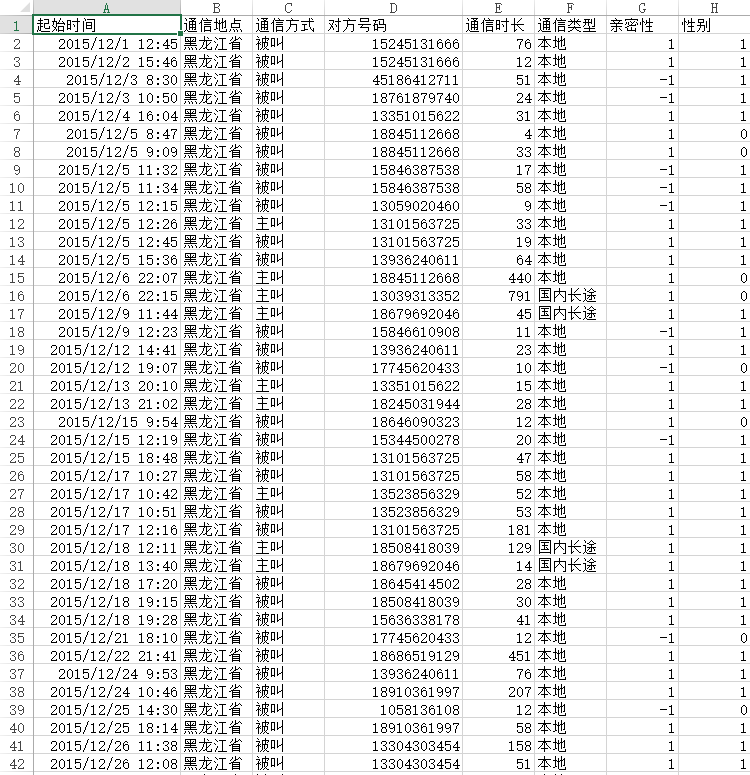

# Homework 2.1 Report

## 预处理数据

预处理数据经过了如下步骤的预处理

1. 删除如下列

  - 执行套餐
  - 实收通信费
  - 网络类型

2. 将通信时长统一为秒为单位

3. 增加"亲密性", "性别"属性，并为每行手动填充数据

  - 亲密性： 1：亲密 -1：不亲密
  - 性别： 1：男 0：女

预处理后的部分数据如下



## 统计每个号码通话时间

将csv数据使用python读入，并以电话号码作为key存入字典中，将多次通话时长累加并排序，得到通话时间的统计。


## 绘制盒图

使用python在matplotlib库的基础上对通话时间这一数据进行盒图绘制。

### 求统计量

首先将通话时间读入并存入数组、排序，并计算如下统计量：

- avg 均值

  ```python
  time_len = len(time)
  time_avg = 0.0
  for t in time:
    time_avg += t * 1.0 / time_len
  ```

- median 中位数

  ```python
  if length % 2 != 0:
    return l[length/2-1]
  else:
    return float(l[length/2-1] + l[length/2]) / 2
  ```

- mode 众数

  ```python
  time_count = {}
  for t in time:
    time_count[t] = time_count.get(t,0) + 1
  sorted_count=sorted(time_count.items(), key = itemgetter(1), reverse = True)
  time_mode = sorted_count[0][0]
  ```

- min 最小值

  ```python
  time.sort()
  time_min = time[0]
  ```

- max 最大值

  ```python
  time.sort()
  time_q1 = time[int(time_len * 0.25)]
  ```

- q1 四分位数：第25个百分位数

  ```python
  time_q1 = time[int(time_len * 0.25)]
  ```

- q3 四分位数：第75个百分位数

  ```python
  time_q1 = time[int(time_len * 0.75)]
  ```


### 绘制盒图

使用matplotlib库绘制坐标轴，axvline和axhline方法绘制盒图的直线，plot方法绘制离群点，并对图像进行额外的修饰。

盒图如下


