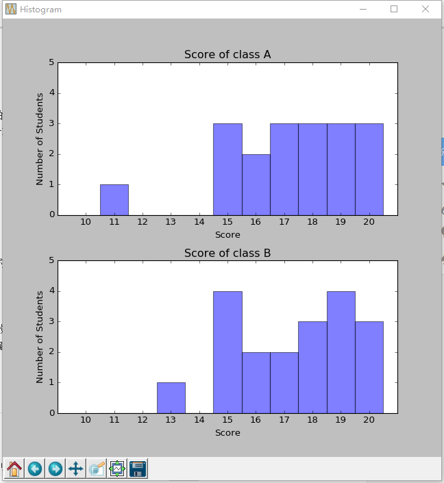
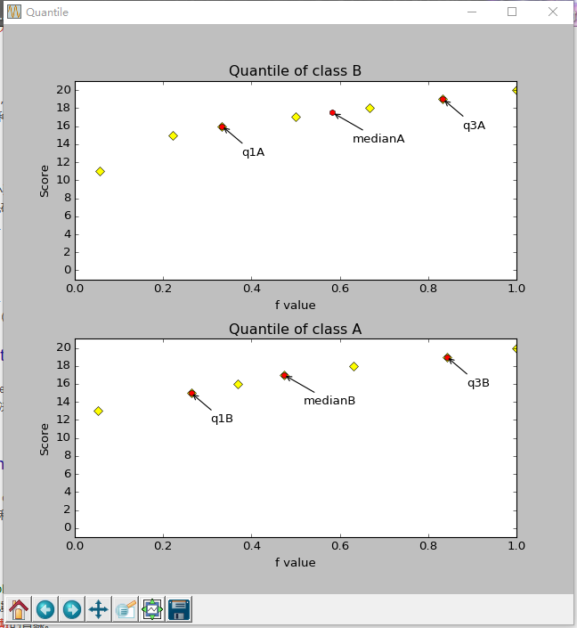

# Homework 2.1 Report

## 直方图 histogram

### 绘制过程

1. 统计已有成绩数据，计算每一分值的人数，存在字典中
2. 使用matplotlib建立坐标系，根据数据情况确定合理的X轴范围（10-20）和Y轴范围（0-5），并绘制刻度、标签等
3. 对于每个有数据的成绩值，以该成绩为中心，X轴坐标+-0.5范围使用axvspan方法绘制矩形，高为该分值的人数
4. 添加表名等标记

### 用途

直方图将数据分布划分成不相交的子集或桶，通常每个桶宽度一致并用一个矩形表示，其高度表示桶中数据在给定数据中出现的计数或频率。在实际的应用中，直方图能够很直观的显示出在不同分值下频数的分布情况，能够给出不同分组直线的数量差别，同时能够获得众数、分布密集范围等信息

## 分位数图 quantile

### 绘制过程

1. 统计已有成绩数据，计算每一分值的人数，存在字典中
2. 从小至大遍历该字典，计算小于等于该值的数据所占比例得到每个出现分数的分位数
3. 使用matplotlib建立坐标系，把每个分位数的点绘制在使用matplotlib建立的坐标系中
4. 计算中位数、Q1、Q3，并使用另外颜色在途中标记出来。该类特殊点有两种定位情况：

  - 如该值在分位数数组中出现过，则定位到该分位数点
  - 如该值在分位数数组中没有出现，则以前后最近两数据所对应的分位数的平均值作为该点在分位数图中的取值

5. 对表名、坐标等进行完善

### 用途

分位数图是观察单变量数据分布的简单有效方法，显示所有的数据，允许用户评估总的情况和不寻常情况的出现，绘出了分位数信息。分位数图是针对单数据的分析，给出了某一数据在整体数据定位的相关信息。

