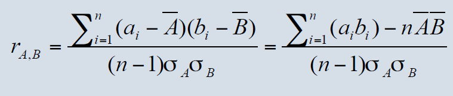

# Homework 2.1 Report

本实验对通话数据集对"总通信时长"和"亲密性"属性进行相关分析。

首先对数据集进行处理，将每行数据中的"通信时长"和"亲密性"提取出来。以电话号码为key建立两个字典，并在迭代的过程中对两个属性针对每个key分别求和，再对亲密性属性进行规范化（value / abs(value)）使得值为1或-1

```python
for line in reader:
    callTime[line['对方号码']] = callTime.get(line['对方号码'],0) + int(line['通信时长'])
    relationship[line['对方号码']] = relationship.get(line['对方号码'],0) + int(line['亲密性'])
for x in relationship:
    relationship[x] = relationship[x] / abs(relationship[x])
```

## 相关系数分析

采用pearson相关系数r对"总通信时长"和"亲密性"进行相关性分析。公式如下



分别求得x，y两个数组的和、平方和，进而求出公式中其他各项的值并求出最终的结果。求得"总通信时长"和"亲密性"的相关系数r=0.411000361347

```python
def pearson(x,y):
    n = len(x)
    vals = range(n)
    sumx = sum([float(x[i]) for i in vals])
    sumy = sum([float(y[i]) for i in vals])
    sumxSq = sum([x[i] ** 2.0 for i in vals])
    sumySq = sum([y[i] ** 2.0 for i in vals])
    pSum = sum([x[i] * y[i] for i in vals])
    num = pSum - (sumx * sumy / n)
    den = ((sumxSq - pow(sumx, 2) / n) * (sumySq - pow(sumy, 2) / n)) ** 0.5

    return (den == 0 and 0 or num / den)
```

## 卡方检验分析

使用卡方检验对"总通信时长"和"亲密性"属性进行分析。

r行c列数据卡方检验的卡方值=n[(A11/n1n1+A12/n1n2+...+Arc/nrnc)-1]

首先对于数据data，针对两个属性的每个取值先进行分别计数得到sumX和sumY，再根据公式求得Aij/xiyj的和，进而进行计算得到卡方值

最后求得卡方值为60.562962963

```python
def chi_square(data, sumX, sumY):
    dataMap = copy.deepcopy(data)
    dataSumX = copy.deepcopy(sumX)
    dataSumY = copy.deepcopy(sumY)
    dataSum = 0
    for x in dataSumX:
        dataSum += dataSumX[x]
    k = 0
    for x in dataMap.keys():
        for y in dataMap[x].keys():
            if dataSumX[x] == 0 or dataSumY[y] == 0:
                continue
            k += 1.0 * dataMap[x][y] ** 2 / dataSumX[x] / dataSumY[y]
    k -= 1
    k *= dataSum
    return k
```
