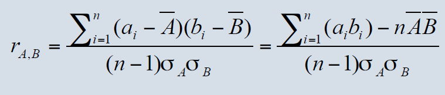

# Homework 2.1 Report

## 缺失处理

本次实验中采用"全局变量填充"和"平均值填充"两种方式

### 全局变量填充

在数据集说明的网站[www.kaggle.com](https://www.kaggle.com/c/dsg-hackathon/data)有如下说明

> Our intention is to ignore these in calculating your score (MAE). To do achieve that effect, we have (in the solution file) transformed all NA's to "-1,000,000".

因此全局变量我们选用-1,000,000这个值进行填充

```python
def missingHandler_global(data, selectedAttr):
    dataList = []
    dataList = copy.deepcopy(data)
    for x in dataList:
        if x[selectedAttr] == 'NA':
            x[selectedAttr] = "-1000000"
            #Selected transformaed number by www.kaggle.com
    return dataList
```

### 平均值填充

在此过程中，我们先对缺失值属性遍历并求出平均值，对于值缺失的项不统计，随后使用平均值进行填充

```python
def missingHandler_avg(data, selectedAttr):
    dataList = []
    dataList = copy.deepcopy(data)
    avg = 0.0
    for x in dataList:
        if x[selectedAttr] != 'NA':
            avg += float(x[selectedAttr])
    avg /= len(dataList)
    for x in dataList:
        if x[selectedAttr] == 'NA':
            x[selectedAttr] = "%f" % avg
    return dataList
```

## 数据规范化

本次实验中采用"最小－最大规范化"和"小数定标规范化"两种方式

### 最小－最大规范化

最小－最大规范化是采用数据中最小值和最大值作为上下界，加其中的数据按照线性关系进行规范化。在此过程中，我们先求得数据集的最小值和最大值，然后按照规范规则{最小值->0， 最大值->1}的方式进行规范化，得到规范化的数据集。为防止缺失值处理过程产生的干扰，我们滤去了取值为"NA"和"-1000000"的数据项

```python
def standardize_minmax(data, selectedAttr):
    dataList = []
    dataList = copy.deepcopy(data)
    dataMin = 100.0
    dataMax = -100.0
    for x in dataList:
        if x[selectedAttr] == 'NA' or x[selectedAttr] == "-1000000":
            continue
        if float(x[selectedAttr]) < dataMin:
            dataMin = float(x[selectedAttr])
        if float(x[selectedAttr]) > dataMax:
            dataMax = float(x[selectedAttr])
    for x in dataList:
        x[selectedAttr] = "%.15f" % ((float(x[selectedAttr]) - dataMin) / (dataMax - dataMin) * (1 - 0) + 0)
    return dataList
```

### 小数定标规范化

小数定标规范化通常是对取值为小数的属性进行规范化的操作。在此过程中，我们先取得小数中的最大值，并以10的j次幂进行缩小，得到其小于1的最大整数j，并以10的j次幂的幅度对全体数据进行规范化

```python
def standardize_decimal(data, selectedAttr):
    dataList = []
    dataList = copy.deepcopy(data)
    dataMax = -100.0
    for x in dataList:
        if x[selectedAttr] == 'NA' or x[selectedAttr] == "-1000000":
            continue
        if float(x[selectedAttr]) > dataMax:
            dataMax = float(x[selectedAttr])
    p = pow(10, int(math.log10(dataMax)) + 1)

    for x in dataList:
        x[selectedAttr] = "%.15f" % (float(x[selectedAttr]) / p)
    return dataList
```

## 相关系数分析

采用pearson相关系数r对"Solar.radiation_64"和"target_1_57"进行相关性分析。公式如下



分别求得x，y两个数组的和、平方和，进而求出公式中其他各项的值并求出最终的结果。求得"Solar.radiation_64"和"target_1_57"的相关系数r=-0.0171368086663

```python
def pearson(x,y):
    n = len(x)
    vals = range(n)
    sumx = sum([float(x[i]) for i in vals])
    sumy = sum([float(y[i]) for i in vals])
    sumxSq = sum([x[i] ** 2.0 for i in vals])
    sumySq = sum([y[i] ** 2.0 for i in vals])
    pSum = sum([x[i] * y[i] for i in vals])
    num = pSum - (sumx * sumy / n)
    den = ((sumxSq - pow(sumx, 2) / n) * (sumySq - pow(sumy, 2) / n)) ** 0.5

    return (den == 0 and 0 or num / den)
```

## 卡方检验分析

使用卡方检验对"weekday"和"Sample.Baro.Pressure_52"属性进行分析。

r行c列数据卡方检验的卡方值=n[(A11/n1n1+A12/n1n2+...+Arc/nrnc)-1]

首先对于数据data，针对两个属性的每个取值先进行分别计数得到sumX和sumY，再根据公式求得Aij/xiyj的和，进而进行计算得到卡方值

最后求得卡方值为5412.53706094

```python
def chi_square(data, sumX, sumY):
    dataMap = copy.deepcopy(data)
    dataSumX = copy.deepcopy(sumX)
    dataSumY = copy.deepcopy(sumY)
    dataSum = 0
    for x in dataSumX:
        dataSum += dataSumX[x]
    k = 0
    for x in dataMap.keys():
        for y in dataMap[x].keys():
            if dataSumX[x] == 0 or dataSumY[y] == 0:
                continue
            k += 1.0 * dataMap[x][y] ** 2 / dataSumX[x] / dataSumY[y]
    k -= 1
    k *= dataSum
    return k
```
